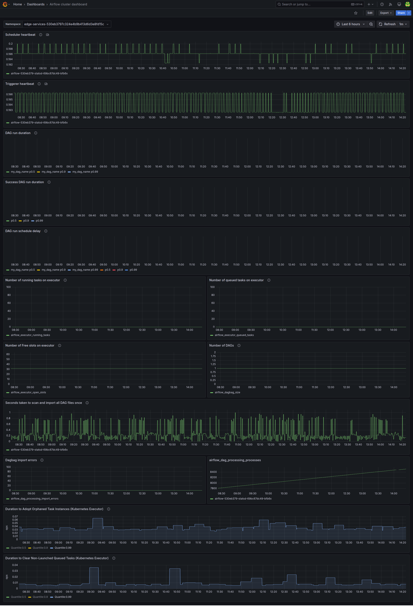

# Airflow Grafana Dashboard
Grafana dashboard to monitor Apache Airflow on Kubernetes using Prometheus

# Grafana Dashboard for Apache Airflow on Kubernetes

This repository contains a pre-configured Grafana dashboard designed to monitor Apache Airflow clusters running on Kubernetes. The dashboard uses **Prometheus** as a datasource and visualizes various Airflow metrics.

---

## 📊 Dashboard Features

- **Scheduler heartbeat**
- **Triggerer heartbeat**
- **DAG run duration (all/successful)**
- **DAG schedule delay**
- **Number of running/queued tasks**
- **Free slots in executor**
- **DAGBag size**
- **Import errors in DAGs**
- **DAG parsing time**
- **Kubernetes Executor adopt/clear durations**

All panels are designed with multi-pod / multi-namespace support using a `namespace` variable.

---

## 📦 Requirements

- Apache Airflow >= 2.5
- Prometheus metrics enabled in Airflow (via `statsd_exporter` or directly)
- Prometheus as a Grafana datasource
- Grafana (version >= 9 recommended)

---

## 🚀 How to Import

1. Go to your Grafana dashboard.
2. Click on the **“+”** sign on the sidebar, then **Import**.
3. Upload the `grafana.json` file from this repository.
4. Select your Prometheus datasource.
5. (Optional) Update the namespace variable.

---

## 🖼️ Preview

> _(You can add a screenshot here)_  
> 

---

## 🧑‍💻 Author

Feel free to open issues or submit improvements! ❤️

---

## 📄 License

This project is released under the MIT License.
